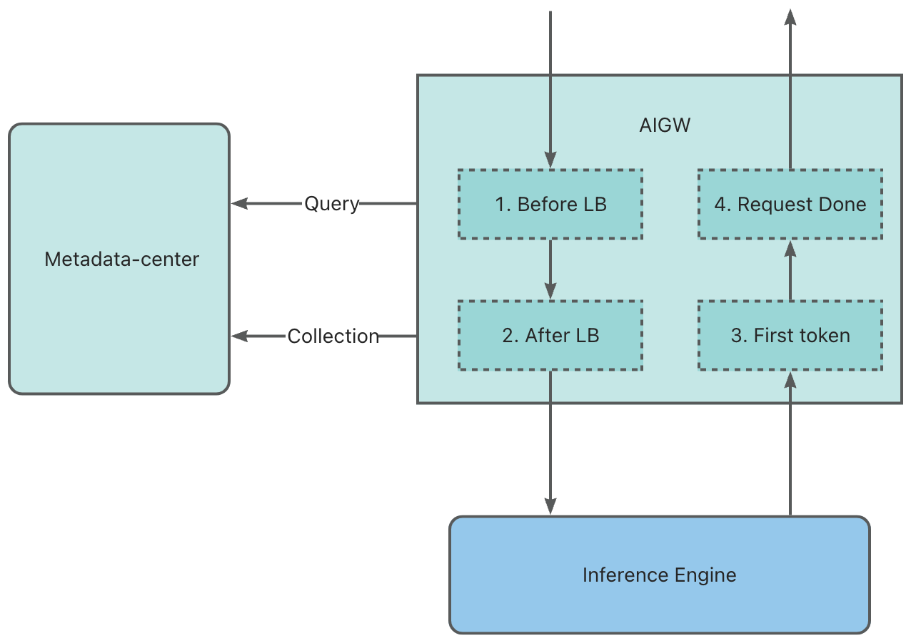

# Metadata Center

专为大规模推理集群智能路由设计的，准实时负载指标统计组件

[English](README.md) | 中文

## 状态

快速迭代中

## 背景

对于大模型推理请求智能路由而言，负载指标是决定效果的重要因素

通常而言，以下四个负载指标是很重要的：（每个引擎维度的）

1. 请求总数量
2. Token 使用量（KVCache 用量）
3. 处于 Prefill 计算的请求数量
4. 处于 Prefill 的 prompt 长度

而指标的时效性又是影响请求调度效果的关键因素。如果采用轮询的方式来获取指标，则避免不了固定周期的时延。

在这个固定周期的等待时间内，很有可能因为同时到达的请求，造成选择相同引擎节点的冲突，进而引发引擎侧排队，造成更高的延迟。

尤其在大规模场景中，随着 QPS（吞吐）的增加，这种冲突的概率也会大幅提升。

## 架构

与推理网关（如 [AIGW](https://github.com/aigw-project/aigw)）协同工作，以下步骤实现准实时的负载指标统计：

1. 请求代理到推理引擎：

   a. 预填充和总请求数量：`+1`

   b. 预填充提示长度：`+prompt-length`

2. 第一个标记响应

   a. 预填充请求数量：`-1`

   b. 预填充提示长度：`-prompt-length`

3. 请求完成

   a. 总请求数量：`-1`

未来有必要的时候，也可以引入 CAS 语义的 API 来降低更大并发场景下的冲突。

## 📚 文档 (Documentation)

- [开发者指南](docs/zh/developer_guide.md)
- [API 文档](docs/zh/api.md)
- [Roadmap](docs/zh/ROADMAP.md)

## 📜 许可证 (License)

本项目采用 [Apache 2.0](LICENSE) 许可证。
