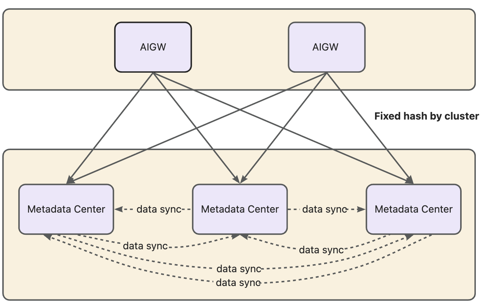
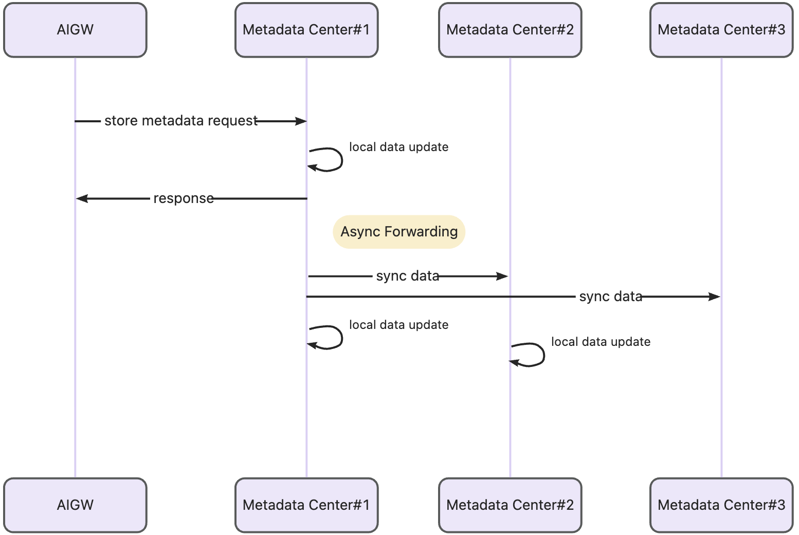

# 高可用架构

## 概述

元数据中心通过多副本事件同步机制实现高可用架构。该机制无需依赖外部协调组件，通过内置的服务发现和事件同步实现集群自治。确保集群中所有实例之间的元数据一致性，提供容错能力和负载分布。

## 架构组件

### 1. 服务发现
- **基于DNS的发现**：使用DNS查询发现所有可用的元数据中心实例
- **本地主机排除**：从同步目标中排除本地实例
- **配置参数**：
  - `META_DATA_CENTER_SVC_DISC_HOST`：用于服务发现解析的DNS域名
  - `REPLICA_DNS_LOOKUP_INTERVAL`：DNS查询间隔（默认：5秒）

### 2. Replicator 客户端
- **事件广播**：向所有发现的实例发送同步事件
- **并发处理**：使用goroutine进行并行事件分发
- **配置参数**：
  - `REPLICA_CLIENT_DIAL_TIMEOUT`：连接超时（默认：500毫秒）
  - `REPLICA_CLIENT_REQUEST_TIMEOUT`：请求超时（默认：1秒）
  - `REPLICA_CLIENT_MAX_IDLE_CONNS`：连接池大小（默认：1024）

### 3. Replicator 服务端
- **事件处理器注册**：支持多种事件类型的自定义处理器
- **请求验证**：验证事件头和负载
- **请求处理** 根据事件类型路由到相应处理器

## 接口设计

### 接口隔离
为防止广播风暴，采用独立的同步接口设计，与业务API接口分离：
- **同步事件接口**：`/v1/replica/event` - 专门处理副本间的事件同步
- **事件类型隔离**：通过 `Event-Type` 头区分不同类型的事件
- **避免循环同步**：同步事件不会再次触发同步，防止广播风暴

### 事件处理
1. 发送方通过 `/v1/replica/event` 发送事件
2. 接收方验证 `Event-Type` 头并路由到对应处理器
3. 处理器处理事件并更新本地状态
4. 处理完成后不会触发新的同步事件

## 同步时序图

## 容错特性

### 1. 重试逻辑
- 同步失败后，每个主机最多重试2次（1次初始尝试 + 1次重试）
- 非200状态码触发重试

### 2. 优雅降级
- 即使某些副本不可用也能继续运行
- 最终一致性模型

### 3. 固定哈希
客户端可通过固定哈希算法选择目标实例，这种设计在数据同步异常时提供重要保障：
- **数据一致性**：同一业务请求在短时间内命中同一副本，数据一致概率高
- **故障隔离**：单点故障不会影响整个集群
- **渐进式恢复**：通过后续同步以及GC机制，达到最终一致性
- **局部影响**：即使发生同步失败，也只会影响部分流量，不会导致全局数据不一致

## 配置参数

| 环境变量                               | 描述         | 默认值   |
|------------------------------------|------------|-------|
| `META_DATA_CENTER_SVC_DISC_HOST`   | 服务发现的DNS域名 | 空     |
| `REPLICA_DNS_LOOKUP_INTERVAL`      | DNS查询间隔    | 5秒    |
| `REPLICA_CLIENT_DIAL_TIMEOUT`      | 连接超时       | 500毫秒 |
| `REPLICA_CLIENT_REQUEST_TIMEOUT`   | 请求超时       | 1秒    |
| `REPLICA_CLIENT_MAX_IDLE_CONNS`    | 连接池大小      | 1024  |
| `REPLICA_CLIENT_IDLE_CONN_TIMEOUT` | 空闲连接超时     | 5分钟   |
| `REPLICA_CLIENT_KEEPALIVE_PERIOD`  | 保活周期       | 10秒   |

